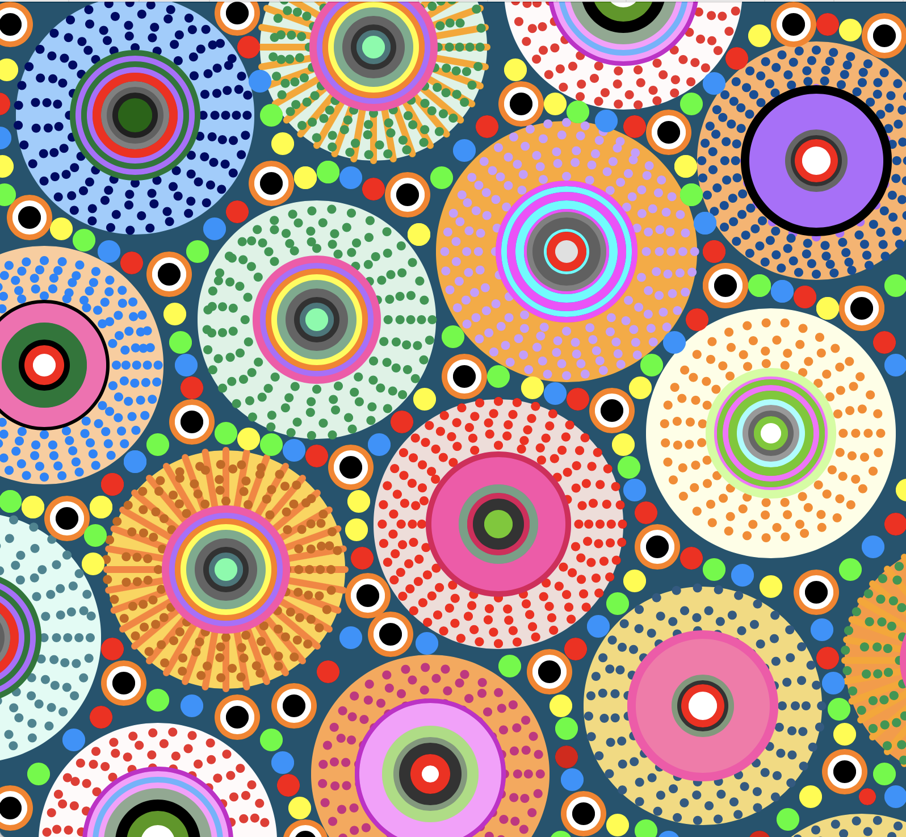
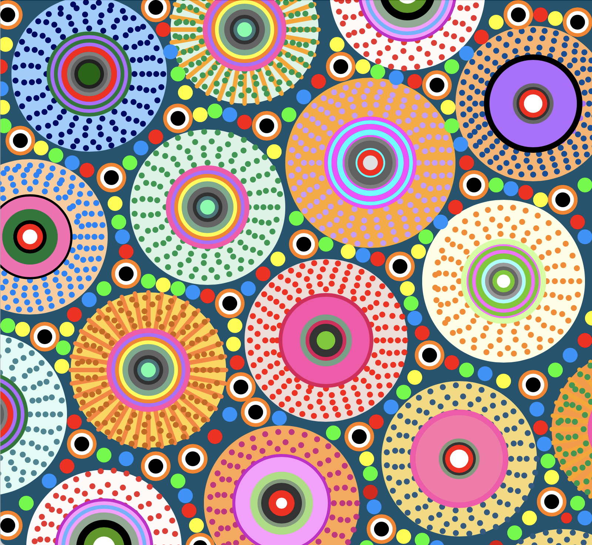
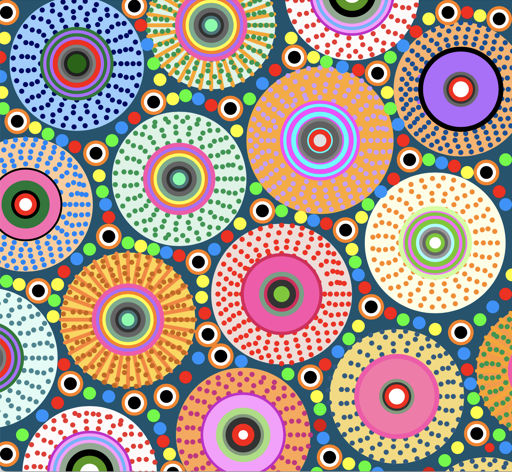

## cwan0804_Chuhan_Wang_GroupD
### Acknowledge
#### I acknowledge that I used Chatgpt to help me find bugs and ask for explanations during the completion of the code.

**Part 1**

Load out the page and you'll see the dots follow the Perlin Noise and start to move in small rhythms, giving the whole image a vibrant feel.

**Part 2**
I chose to drive my code through Berlin Noise. Since we learned about Berlin Noise in week 10, it was also used in our most recent quiz. And I found Berlin Noise so interesting that I wanted to try using it again to create an effect.

My group chose to make the circle rotate and to make the circle change color. We wanted to make a difference so we both chose to change the parts that were different. In the last week of feedback I came across the YouTube video 'Coding Challenge #56: Attraction and Repulsion Forces' made by The Coding Train. In this video, the visual effects created by attraction and repulsion are introduced. I thought it was very interesting, but when I watched the whole video I realized that combining this technique with Perlin noise was too difficult for me to make progress after several attempts.

[Coding Challenge #56: Attraction and Repulsion Forces](https://youtu.be/OAcXnzRNiCY?si=bjAx5Z6FojoYESxF)

But based on this video I was able to pinpoint the object I wanted to change to the little dots inside the big circle. I edited the code based on what I had learned in my previous classes and the tutorial on the topic of Perlin Noise created by The Coding Train. 

[Perlin Noise in p5.js](https://youtu.be/Qf4dIN99e2w?si=ESNlaXj1GN2TcW94)

However, I realized that I could see the dots change position every time I refreshed, but they were static when I didn't refresh.

After repeated attempts, I sent the code I wrote to Chatgpt to help me find out what part of it was wrong. Then I realized that it should be because I did not succeed in limiting the effect to the function of the dots, even though I was working on the function of the dots. This caused the system to fail to understand my intention and run incorrectly.

After improving it I had Chatgpt explain it to me in more detail, and the process made me feel like I understood the technique.